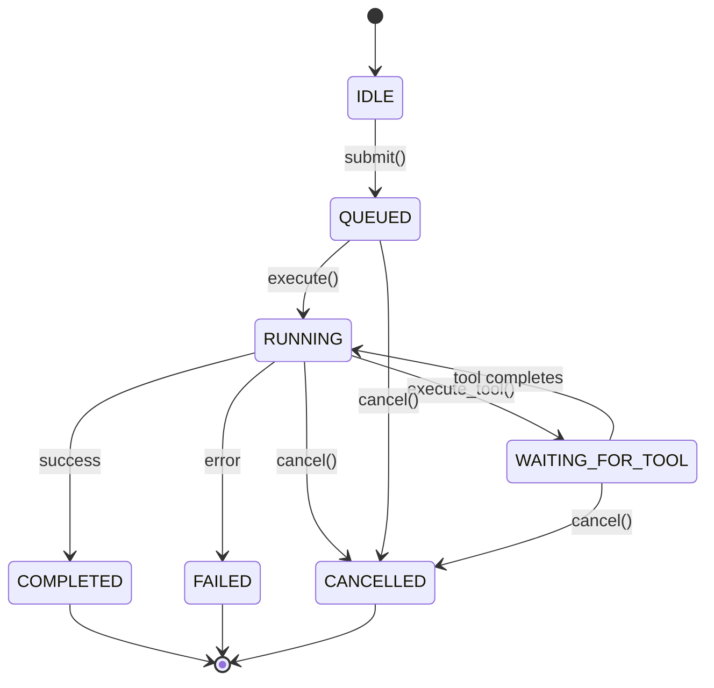
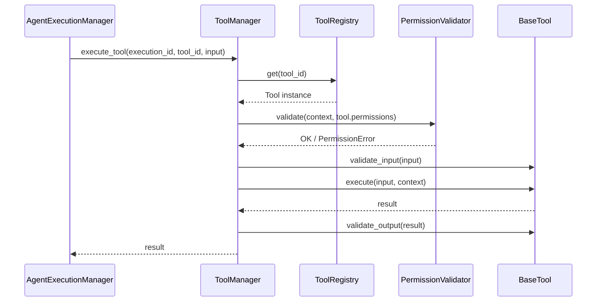
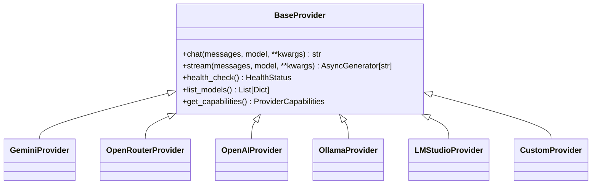
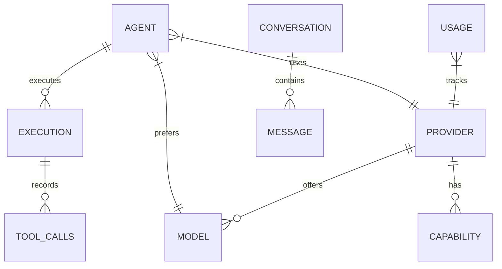
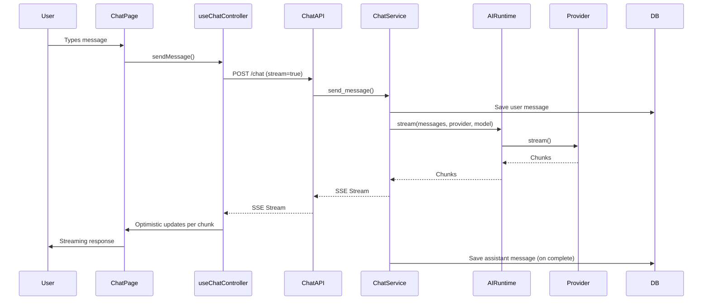
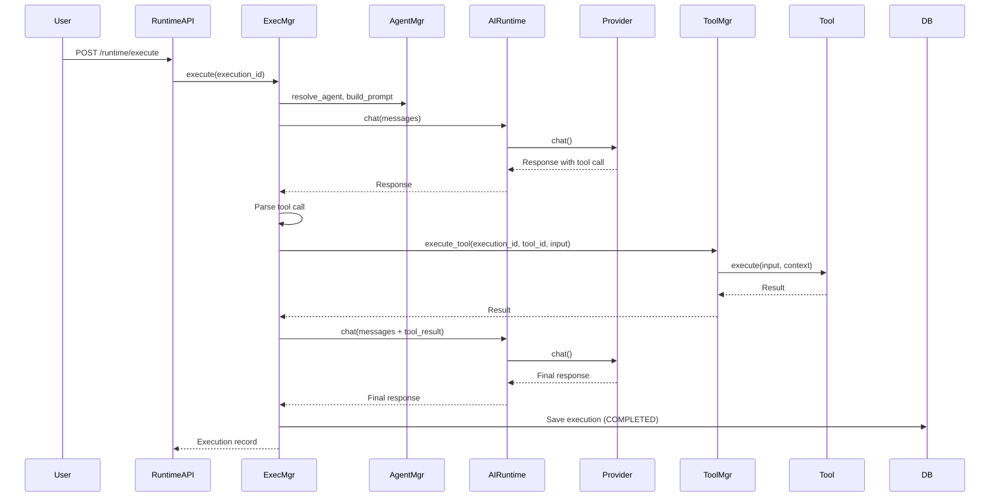

# NEXUS Architecture

> Complete system architecture with diagrams, layer responsibilities, and design rationale.

---

## High-Level Architecture

```mermaid
graph TB
    subgraph "UI LAYER"
        UI[React 18 + TypeScript]
        Pages[Pages: Chat, Agents, Providers, Tools, Memory, Workflows, Workspace]
        Components[Components: Core, Layout, Chat, Agents, Providers]
        Hooks[Hooks: useChatController, useConversationManager, useOptimisticMessages]
        Stores[Stores: agentStore, providerStore, modelStore]
        APIClient[API Client: TanStack Query + Axios]
    end

    subgraph "API LAYER"
        FastAPI[FastAPI App]
        Router[API Router]
        AgentsAPI[/api/v1/agents]
        ChatAPI[/api/v1/chat]
        ProvidersAPI[/api/v1/providers]
        ToolsAPI[/api/v1/tools]
        RuntimeAPI[/api/v1/runtime]
        HealthAPI[/api/v1/health]
    end

    subgraph "SERVICE LAYER"
        AgentService[AgentService]
        ChatService[ChatService]
        ProviderService[ProviderService]
        ExecutionManager[AgentExecutionManager]
        ToolManager[ToolManager]
        AIRuntime[AIRuntime]
        UsageTracker[UsageTracker]
        RetryPolicy[RetryPolicy]
        FallbackPolicy[FallbackPolicy]
    end

    subgraph "RUNTIME LAYERS"
        AgentRuntime[Agent Runtime]
        ToolRuntime[Tool Runtime]
        ProviderRuntime[Provider Runtime]
    end

    subgraph "AGENT RUNTIME"
        StateMachine[Execution State Machine]
        PromptBuilder[PromptBuilder v2]
        AgentManager[AgentManager]
    end

    subgraph "TOOL RUNTIME"
        ToolRegistry[ToolRegistry]
        ToolManager2[ToolManager]
        Permissions[PermissionValidator]
        ExecContext[ExecutionContext]
        Builtins[Built-in Tools: Browser, Python, Terminal, File, Memory, Search]
    end

    subgraph "PROVIDER RUNTIME"
        BaseProvider[BaseProvider Abstract]
        Providers[15+ Implementations]
        HealthCheck[Health Monitoring]
        ModelDiscovery[Model Discovery]
        Capabilities[Capability Detection]
    end

    subgraph "DATA LAYER"
        SQLite[(SQLite Database)]
        SQLAlchemy[SQLAlchemy 2.0 ORM]
        Models[Models: Agent, Conversation, Message, Execution, Provider, Model, Capability, Usage, Settings]
        Repositories[Repositories: BaseRepository + Specialized]
        Migrations[Alembic + Custom Migrations]
    end

    UI --> FastAPI
    FastAPI --> Router
    Router --> AgentsAPI
    Router --> ChatAPI
    Router --> ProvidersAPI
    Router --> ToolsAPI
    Router --> RuntimeAPI
    Router --> HealthAPI

    AgentsAPI --> AgentService
    ChatAPI --> ChatService
    ProvidersAPI --> ProviderService
    RuntimeAPI --> ExecutionManager
    ToolsAPI --> ToolManager
    ChatAPI --> AIRuntime

    AgentService --> ExecutionManager
    ChatService --> AIRuntime
    ExecutionManager --> ToolManager
    ExecutionManager --> AIRuntime
    ExecutionManager --> AgentManager
    ExecutionManager --> RetryPolicy
    ExecutionManager --> FallbackPolicy
    ExecutionManager --> UsageTracker

    ToolManager --> ToolRegistry
    ToolManager --> Permissions
    ToolManager --> ExecContext
    ToolRegistry --> Builtins

    AIRuntime --> BaseProvider
    BaseProvider --> Providers
    Providers --> HealthCheck
    Providers --> ModelDiscovery
    Providers --> Capabilities

    AgentService --> Repositories
    ChatService --> Repositories
    ProviderService --> Repositories
    ExecutionManager --> Repositories
    ToolManager --> Repositories
    AIRuntime --> Repositories

    Repositories --> SQLAlchemy
    SQLAlchemy --> Models
    Models --> SQLite
    Migrations --> SQLite
```

---

## Layer Responsibilities

### 1. UI Layer (Frontend)

**Location**: `frontend/src/`

| Component | Responsibility |
|-----------|----------------|
| **Pages** | Top-level route components (ChatPage, AgentsPage, ProvidersPage, etc.) |
| **Components** | Reusable UI primitives organized by domain (Chat, Agents, Core, Layout, Providers) |
| **Hooks** | Business logic extraction (useChatController, useConversationManager, useOptimisticMessages) |
| **Stores** | Client-side state (Zustand): agentStore, providerStore, modelStore |
| **API Client** | TanStack Query + Axios for server state, caching, mutations |

**Key Principles**:
- **Optimistic Updates**: Immediate UI feedback, sync with server in background
- **Streaming First**: All chat uses SSE streaming via `useOptimisticMessages`
- **Component Composition**: Small, focused components with clear props
- **Motion Everywhere**: Framer Motion for all transitions, no static jumps

---

### 2. API Layer (FastAPI Routes)

**Location**: `backend/api/`

| Route Module | Endpoints | Responsibility |
|--------------|-----------|----------------|
| `agent_routes.py` | `/agents` | Agent CRUD, clone, default, test (streaming + non-streaming) |
| `chat.py` | `/chat`, `/conversations` | Conversation management, message streaming |
| `providers.py` | `/providers` | Provider CRUD, health, model discovery, capabilities |
| `tools.py` | `/tools` | Tool discovery, execution, streaming, cancellation |
| `runtime.py` | `/runtime` | Execution lifecycle: submit, execute, stream, cancel, history |
| `ai_runtime.py` | `/ai/chat`, `/ai/stream` | Unified provider-agnostic chat endpoints |
| `health.py` | `/health` | System health checks |

**Pattern**: Every route → validates input (Pydantic) → calls Service → returns Response. No business logic in routes.

---

### 3. Service Layer

**Location**: `backend/services/`

| Service | Responsibility |
|---------|----------------|
| **AgentService** | Agent CRUD, cloning, default management, testing |
| **ChatService** | Conversation/message persistence, message building for providers |
| **ProviderService** | Provider CRUD, health checks, model sync, capability detection |
| **AgentExecutionManager** | **Core orchestration**: execution lifecycle, state machine, retry/fallback, tool integration |
| **ToolManager** | Tool execution lifecycle: lookup, permissions, validation, retries, cancellation, logging |
| **AIRuntime** | Unified gateway for all provider communication (chat + stream) |
| **UsageTracker** | Token counting, cost estimation, usage persistence |
| **RetryPolicy** | Exponential backoff, retry decisions |
| **FallbackPolicy** | Provider fallback selection on failure |

**Dependency Injection**: Services receive `Session` (DB) in constructor. No global state.

---

### 4. Runtime Layers (The Three Pillars)

#### 4.1 Agent Runtime

**Location**: `backend/services/execution_manager.py`, `backend/agents/`

| Component | Responsibility |
|-----------|----------------|
| **Execution State Machine** | IDLE → QUEUED → RUNNING → WAITING_FOR_TOOL → COMPLETED/FAILED/CANCELLED |
| **PromptBuilder v2** | Assembles system prompt: agent config + conversation + workspace + memory + tools + capabilities |
| **AgentManager** | Agent resolution, config building, prompt building, execution validation |
| **AgentExecutionManager** | Orchestrates full lifecycle, integrates ToolManager, handles streaming + non-streaming |

**State Machine**:


#### 4.2 Tool Runtime

**Location**: `backend/tools/`

| Component | Responsibility |
|-----------|----------------|
| **ToolRegistry** | Auto-discovers tools from `tools.builtins` via `pkgutil`, registers by id/name/category |
| **ToolManager** | Executes tools with: permission check → input validation → retry (exponential backoff) → output validation → logging |
| **PermissionValidator** | Validates agent has required permissions (wildcard `*` for dev mode) |
| **ExecutionContext** | Shared context between Agent/Tool runtimes: execution_id, agent_id, conversation_id, cancel_event, logger |
| **Built-in Tools** | Browser, Python, Terminal, File, Memory, Search (all placeholders with schemas) |

**Tool Execution Flow**:


#### 4.3 Provider Runtime

**Location**: `backend/providers/`

| Component | Responsibility |
|-----------|----------------|
| **BaseProvider** | Abstract base: `chat()`, `stream()`, `health_check()`, `list_models()`, `get_capabilities()` |
| **15+ Implementations** | Gemini, OpenRouter, OpenAI, Anthropic, Azure, Groq, Together, Perplexity, xAI, Mistral, Cohere, Ollama, LM Studio, NVIDIA NIM, DeepSeek, Custom |
| **Health Monitoring** | Periodic health checks, status tracking (healthy/degraded/unhealthy) |
| **Model Discovery** | Dynamic model listing from each provider |
| **Capability Detection** | Streaming, function calling, vision, JSON mode, etc. |

**Provider Abstraction**:


---

### 5. Data Layer

**Location**: `backend/models/`, `backend/repositories/`, `backend/alembic/`, `backend/migrations.py`

| Component | Responsibility |
|-----------|----------------|
| **Models** | SQLAlchemy declarative models: Agent, Conversation, Message, Execution, Provider, Model, Capability, Usage, Settings |
| **BaseRepository** | Generic CRUD: create, get, update, delete, list with pagination |
| **Specialized Repositories** | AgentRepository, ConversationRepository, MessageRepository, ProviderRepository |
| **Migrations** | Alembic for schema versioning + custom `migrations.py` for idempotent SQLite ALTER TABLE |

**Key Models**:


---

## Dependency Direction (Strict)

```
UI Layer
    ↓ (HTTP/JSON)
API Layer
    ↓ (Function calls)
Service Layer
    ↓ (Function calls)
Runtime Layers (Agent, Tool, Provider)
    ↓ (Function calls)
Data Layer (Repositories → ORM → DB)
```

**Rules**:
1. **No upward dependencies** — Data layer never imports from services
2. **No cross-runtime dependencies** — Tool Runtime doesn't import Agent Runtime
3. **Interfaces over implementations** — Services depend on `BaseProvider`, not `GeminiProvider`
4. **Dependency Injection** — DB session passed in, not global

---

## SOLID Principles in Practice

| Principle | Application |
|-----------|-------------|
| **Single Responsibility** | Each service/class has one reason to change. `AgentExecutionManager` only orchestrates execution. |
| **Open/Closed** | Add new providers by extending `BaseProvider`, never modifying `AIRuntime`. Add tools by extending `BaseTool`. |
| **Liskov Substitution** | Any `BaseProvider` implementation works in `AIRuntime`. Any `BaseTool` works in `ToolManager`. |
| **Interface Segregation** | `BaseProvider` has minimal interface. `BaseTool` separates `execute` from `execute_stream`. |
| **Dependency Inversion** | High-level `AIRuntime` depends on abstraction `BaseProvider`, not concrete providers. |

---

## Data Flow Examples

### Chat Message Flow (Streaming)



### Agent Execution with Tool Call



---

## Configuration & Environment

**Backend** (`backend/config.py`):
- `environment`: development/production
- `database_url`: SQLite default `sqlite:///./data/nexus.db`
- `api_v1_prefix`: `/api/v1`
- `cors_origins`: Frontend dev servers
- `secret_key`, `api_key_encryption_key`: For encryption

**Frontend** (`frontend/.env`):
- `VITE_API_URL`: Backend URL (default `http://localhost:8000`)

---

## Testing Strategy

| Layer | Framework | Coverage |
|-------|-----------|----------|
| **Backend Unit** | pytest + pytest-asyncio | 141 tests (services, runtimes, models) |
| **Backend Integration** | pytest + TestClient | API endpoints, DB operations |
| **Frontend Unit** | Vitest + React Testing Library | Components, hooks, stores |
| **E2E** | Playwright (planned) | Critical user flows |

**Run All Tests**:
```bash
cd backend && python -m pytest tests/ -v
cd frontend && npm test
```

---

## Extensibility Points

| Extension Point | How to Extend |
|-----------------|---------------|
| **New Provider** | Create `providers/new_provider.py` extending `BaseProvider`, register in `providers/__init__.py` |
| **New Tool** | Create `tools/builtins/new_tool.py` extending `BaseTool`, export `TOOL` instance |
| **New Agent Type** | Create `agents/new_agent.py` extending `BaseAgent`, register in `AgentManager` |
| **New API Endpoint** | Add route in `api/`, schema in `schemas/`, service logic in `services/` |
| **New UI Page** | Create `pages/NewPage.tsx`, add route in `App.tsx`, add nav in `Sidebar.tsx` |

---

## Security Considerations

| Area | Implementation |
|------|----------------|
| **API Keys** | Encrypted at rest using `api_key_encryption_key` (Fernet) |
| **CORS** | Configurable origins, credentials allowed |
| **Input Validation** | Pydantic v2 on all API inputs |
| **SQL Injection** | SQLAlchemy ORM (parameterized queries) |
| **XSS** | React auto-escapes, no `dangerouslySetInnerHTML` |
| **Local-First** | No required external connections |

---

## Performance Considerations

| Concern | Solution |
|---------|----------|
| **Streaming Latency** | Chunked SSE, no buffering in middleware |
| **DB Queries** | Joined loading for relationships, pagination on lists |
| **Provider Calls** | Connection pooling via httpx, model caching |
| **Frontend Re-renders** | Zustand selectors, React.memo, TanStack Query caching |
| **Large Conversations** | Message pagination, virtualized lists |

---

## Future Architecture Evolution

| Phase | Architectural Change |
|-------|---------------------|
| **8 - Memory** | Add Vector DB (pgvector/Chroma), Embedding Service, Memory Manager |
| **9 - Multi-Agent** | Agent Communication Bus, Shared Context Store, Delegation Protocol |
| **10 - Workflows** | DAG Engine, Workflow Definition Language, Visual Builder |
| **11 - Skills** | Sandboxed Execution (WASM/Deno), Skill Manifest, Marketplace |
| **12 - Desktop** | Tauri Backend, Native IPC, System Integration |
| **13 - Marketplace** | Registry Service, Publishing Pipeline, Versioning |
| **14 - Collaboration** | WebRTC/WebSocket Sync, CRDTs, Presence |
| **15 - AI OS** | File System Access, Process Management, System APIs |

---

## Related Documents

- [Master Context](NEXUS_MASTER_CONTEXT.md) — Project overview
- [AI Onboarding](AI_ONBOARDING.md) — Quick start guide
- [Project Structure](PROJECT_STRUCTURE.md) — Directory purposes
- [Roadmap](ROADMAP.md) — Phase details
- [Agent System](AGENT_SYSTEM.md) — Agent runtime deep dive
- [Tool Runtime](TOOL_RUNTIME.md) — Tool runtime deep dive
- [Provider System](PROVIDER_SYSTEM.md) — Provider runtime deep dive