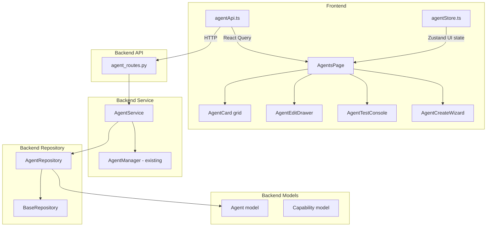

# Phase 2.2 — Agent Management Module

## Objective
Transform agents into fully manageable entities with complete CRUD, configuration, capabilities, status management, testing (with live streaming), and an enterprise-quality UI.

## Constraints
- Preserve backward compatibility with existing chat pipeline
- Maintain clean architecture (Repository → Service → API layers)
- No duplicate state (React Query for server state, Zustand for UI state only)
- `npm run type-check`, `npm run lint`, `npm run build` must all pass
- `python -m pytest tests/` must pass
- `python -m compileall .` must be clean

---

## Architecture Overview

---

## Backend Changes

### 1. Model: `backend/models/agent.py`
Add missing columns to match the required configuration fields:
- `presence_penalty` (Float, default=0.0)
- `frequency_penalty` (Float, default=0.0)
- `is_default` (Boolean, default=False) — marks the default agent

Add a database migration via `backend/migrations.py` (migration 002).

### 2. Repository: `backend/repositories/agent_repository.py` (NEW)
Extends `BaseRepository[Agent]` with agent-specific queries:
- `find_by_name(name)` — uniqueness check
- `find_default_agent()` — get the agent with `is_default=True`
- `clone(agent_id)` — deep copy an agent (new name, `is_default=False`, `enabled=True`)
- `set_default(agent_id)` — unset `is_default` on all others, set on this one

### 3. Service: `backend/services/agent_service.py` (NEW)
Business logic layer:
- `list_agents()` — return all agents
- `get_agent(agent_id)` — single agent with 404 handling
- `create_agent(data)` — validate name uniqueness, create
- `update_agent(agent_id, data)` — validate, partial update
- `delete_agent(agent_id)` — prevent deleting the default agent
- `clone_agent(agent_id)` — clone via repository, append "(Copy)" to name
- `set_default_agent(agent_id)` — delegate to repository
- `test_agent(agent_id, message, stream)` — delegate to AgentManager + AIRuntime, measure latency, return response + metadata
- `test_agent_stream(agent_id, message)` — async generator yielding SSE chunks via AIRuntime.stream()
- Validation: name not empty, temperature 0-2, top_p 0-1, max_tokens > 0, penalties -2 to 2

### 4. Schemas: `backend/schemas/agent.py`
- Add `presence_penalty: float = 0.0` and `frequency_penalty: float = 0.0` to `AgentBase`
- Add `is_default: bool = False` to `AgentBase` and `AgentResponse`
- Add `AgentCloneResponse(AgentResponse)` — same as AgentResponse (for type clarity)
- Add `AgentTestStreamRequest` — `{ message: str, provider_id?: int, model?: str }`
- Add field validators: temperature range, top_p range, penalty ranges
- Update `AgentUpdate` with new optional fields

### 5. Routes: `backend/api/agent_routes.py`
Rewrite to use `AgentService` instead of direct DB queries:
- `GET /agents` — list all
- `GET /agents/{id}` — get one
- `POST /agents` — create (validation via service)
- `PATCH /agents/{id}` — update (partial)
- `DELETE /agents/{id}` — delete (prevent default deletion)
- `POST /agents/{id}/clone` — clone agent (NEW)
- `PATCH /agents/{id}/default` — set as default (NEW)
- `POST /agents/{id}/test` — non-streaming test (existing, enhanced with token usage)
- `POST /agents/{id}/test-stream` — streaming test via SSE (NEW)

### 6. Migration: `backend/migrations.py`
Add migration 002: add `presence_penalty`, `frequency_penalty`, `is_default` columns to agents table.

### 7. Tests: `backend/tests/test_agent_api.py` (NEW)
- `test_list_agents`
- `test_get_agent`
- `test_get_agent_not_found`
- `test_create_agent`
- `test_create_agent_duplicate_name`
- `test_update_agent`
- `test_update_agent_not_found`
- `test_delete_agent`
- `test_delete_default_agent_fails`
- `test_clone_agent`
- `test_clone_agent_not_found`
- `test_set_default_agent`
- `test_test_agent` (mocked AIRuntime)
- `test_validation_temperature_out_of_range`
- `test_validation_top_p_out_of_range`

---

## Frontend Changes

### 8. Types: `frontend/src/types/agent.ts`
- Add `presence_penalty: number`
- Add `frequency_penalty: number`
- Add `is_default: boolean`
- Add `AgentTestStreamResponse` interface

### 9. API: `frontend/src/services/agentApi.ts`
- Add `cloneAgent(id)` → `POST /agents/{id}/clone`
- Add `setDefaultAgent(id)` → `PATCH /agents/{id}/default`
- Add `testAgentStream(id, message)` → `POST /agents/{id}/test-stream` (fetch with ReadableStream for SSE parsing)

### 10. Store: `frontend/src/stores/agentStore.ts`
- Keep Zustand for UI-only state (selected agent, drawer open/closed, filter/sort)
- Do NOT cache agent list (React Query handles that)

### 11. Components (NEW & MODIFIED)

#### `frontend/src/components/Agents/AgentEditDrawer.tsx` (NEW)
Full edit form with all configuration fields:
- Name, Description, Icon, Color, Category
- Provider (dropdown), Model (dropdown filtered by provider)
- System Prompt (textarea with template variable hints)
- Temperature (slider 0-2), Max Tokens (number), Top P (slider 0-1)
- Presence Penalty (slider -2 to 2), Frequency Penalty (slider -2 to 2)
- Capabilities multi-select (checkbox list)
- Streaming toggle, Enabled toggle, Memory toggle
- Set as Default button
- Save/Cancel with validation
- Uses React Query `useMutation` for update

#### `frontend/src/components/Agents/AgentTestConsole.tsx` (ENHANCED)
- Add live streaming mode (toggle between non-stream and stream)
- Display runtime info: provider name, model, latency, token usage
- Error display with provider error parsing
- Streaming response rendered incrementally
- Uses fetch + ReadableStream for SSE parsing

#### `frontend/src/components/Agents/AgentCreateWizard.tsx` (ENHANCED)
- Add all new fields (presence_penalty, frequency_penalty, category)
- Add capabilities multi-select
- Add validation (name required, ranges enforced)
- Use React Query mutation

#### `frontend/src/components/Agents/AgentCapabilitiesSelector.tsx` (NEW)
- Multi-select checkbox list of capabilities
- Available capabilities: streaming, vision, embeddings, tools, images, audio, reasoning
- Toggle enable/disable each
- Stores as JSON array string in `capabilities` field

#### `frontend/src/components/Agents/AgentCard.tsx` (NEW — extracted from AgentsPage)
- Presentational component for single agent card
- Shows icon, name, status badge, provider, model, capability tags
- Action buttons: Edit, Clone, Delete, Test
- Smooth hover animation

#### `frontend/src/components/Agents/AgentCardSkeleton.tsx` (NEW)
- Loading skeleton matching AgentCard layout
- Animated pulse effect

### 12. Pages

#### `frontend/src/pages/AgentsPage.tsx` (ENHANCED)
- Loading skeletons (AgentCardSkeleton grid) instead of plain text
- Empty state with illustration and "Create your first agent" CTA
- Smooth card entrance animations (CSS transitions)
- Wire up Edit button to open AgentEditDrawer
- Wire up Clone button to call `cloneAgent` mutation
- Wire up Set Default action
- Confirmation dialog for delete (prevent default agent deletion)
- React Query mutations with optimistic updates and cache invalidation
- Responsive grid: 1 col mobile, 2 col tablet, 3 col desktop

---

## Implementation Order

1. **Backend model + migration** — add columns, run migration
2. **Backend repository** — AgentRepository
3. **Backend service** — AgentService with validation
4. **Backend schemas** — update with new fields + validators
5. **Backend routes** — rewrite agent_routes.py
6. **Backend tests** — write and verify all pass
7. **Frontend types + API** — update types and agentApi
8. **Frontend components** — AgentCapabilitiesSelector, AgentCard, AgentCardSkeleton, AgentEditDrawer
9. **Frontend enhanced components** — AgentTestConsole (streaming), AgentCreateWizard (new fields)
10. **Frontend page** — AgentsPage with skeletons, empty states, animations, wiring
11. **Verification** — type-check, lint, build, pytest, compileall

---

## Backward Compatibility

- Existing `POST /chat` endpoint unchanged — it reads agent by ID from DB, new columns have defaults
- `AgentManager.resolve_agent()` unchanged — still creates fresh DefaultAgent per request
- `AIRuntime.chat()` / `stream()` unchanged
- Existing 5 seeded agents get `is_default=False` (no default set initially, or set Assistant as default in migration)
- Frontend `AgentSelector` in chat continues to work — reads from same `/agents` endpoint
- New fields are optional with defaults — no breaking changes to existing API consumers

---

## Verification Checklist

- [ ] `python -m compileall .` — clean
- [ ] `python -m pytest tests/` — all pass (including new test_agent_api.py)
- [ ] `npm run type-check` — no errors
- [ ] `npm run lint` — no errors
- [ ] `npm run build` — succeeds
- [ ] All 5 default agents still visible in UI
- [ ] Create agent works with all fields
- [ ] Edit agent works with all fields
- [ ] Clone agent creates copy with "(Copy)" suffix
- [ ] Delete agent works (default agent cannot be deleted)
- [ ] Set default agent works
- [ ] Test agent (non-streaming) shows response, latency, provider, model
- [ ] Test agent (streaming) shows response incrementally
- [ ] Capabilities multi-select works
- [ ] Loading skeletons display during fetch
- [ ] Empty state displays when no agents
- [ ] Responsive layout works on mobile/tablet/desktop
