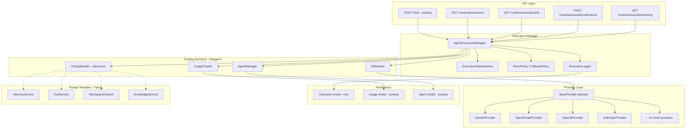

# Phase 6 — AI Agent Runtime: Architecture Plan

## 1. Executive Summary

NEXUS is evolving from a chatbot into an **AI Operating System**. This phase builds the **Agent Runtime** — the central execution engine that powers every intelligent capability. The runtime wraps the existing [`AIRuntime`](backend/services/ai_runtime.py:15), [`AgentManager`](backend/agents/manager.py:11), and provider layer with a formal execution lifecycle, persistence, retry/fallback policies, and a dynamic prompt assembly pipeline.

### Key Design Principles
- **Provider-agnostic**: The runtime operates through the abstract [`BaseProvider`](backend/providers/base.py:35) interface; no provider-specific logic leaks into execution management.
- **SOLID**: Single-responsibility classes; open for extension (new agent types, tools, memory backends) but closed for modification of the core execution loop.
- **Non-breaking**: The existing [`POST /chat`](backend/api/chat.py:151) endpoint continues to work exactly as before. The new runtime API is additive.
- **Observable**: Every execution is persisted with execution ID, timestamps, token usage, provider metadata, and status transitions for Mission Control inspection.

---

## 2. Current State Analysis

### 2.1 Execution Flow Today (Fragmented)

The current chat execution path is spread across four components with no central coordination:

```
POST /chat (chat.py:151)
  ├─ AgentManager.resolve_agent()        → gets agent from DB, creates DefaultAgent
  ├─ AgentManager.get_agent_config()     → extracts provider_id, model, temperature, etc.
  ├─ AgentManager.validate_execution()   → checks provider exists, is active, model available
  ├─ ChatService.send_message()          → saves user message, builds message list
  ├─ AgentManager.build_prompt_for_agent() → calls DefaultAgent.buildPrompt() → PromptBuilder.build()
  ├─ AIRuntime.stream() or AIRuntime.chat() → resolves provider, decrypts key, calls provider
  └─ ChatService._save_assistant_message() → persists response
```

**Problems:**
1. No execution ID — cannot reference or cancel a specific run
2. No state machine — no visibility into whether an execution is queued, running, waiting for a tool, etc.
3. No execution persistence — no audit trail for Mission Control
4. No retry/fallback — if a provider fails, the user gets an error with no recovery
5. PromptBuilder has placeholder variables (`{{memory}}`, `{{workspace}}`, `{{files}}`) that are never populated
6. UsageTracker exists but is called ad-hoc, not systematically on every execution
7. The procedural code in [`chat.py:151-294`](backend/api/chat.py:151) mixes concerns: agent resolution, validation, message saving, prompt building, and provider execution all in one function

### 2.2 What Already Exists (Reusable)

| Component | File | What It Does | Reuse Strategy |
|-----------|------|--------------|----------------|
| [`AIRuntime`](backend/services/ai_runtime.py:15) | `backend/services/ai_runtime.py` | Central gateway: resolves provider, decrypts key, calls `provider.chat()` / `provider.stream()`, tracks usage | **Wrap, don't replace** — AgentExecutionManager delegates to AIRuntime for actual provider calls |
| [`AgentManager`](backend/agents/manager.py:11) | `backend/agents/manager.py` | Resolves agent from DB, builds prompt, gets config, validates execution | **Wrap, don't replace** — AgentExecutionManager uses AgentManager for agent resolution and config |
| [`PromptBuilder`](backend/agents/prompt_builder.py:3) | `backend/agents/prompt_builder.py` | Template variable substitution (`{{agent}}`, `{{today}}`, etc.) | **Enhance** — add real variable resolvers for memory, workspace, tools, conversation context |
| [`UsageTracker`](backend/services/usage_tracker.py:9) | `backend/services/usage_tracker.py` | Tracks token usage and estimates cost | **Integrate** — call systematically from AgentExecutionManager on every execution |
| [`BaseProvider`](backend/providers/base.py:35) | `backend/providers/base.py` | Abstract interface: `chat()`, `stream()`, `health_check()`, `list_models()` | **Unchanged** — the runtime operates through this interface |
| [`AgentService.test_agent()`](backend/services/agent_service.py:131) | `backend/services/agent_service.py` | Test execution with latency measurement | **Pattern to follow** — this is the closest existing code to an execution manager |
| [`Agent`](backend/models/agent.py:5) model | `backend/models/agent.py` | Agent configuration with all columns | **Unchanged** — read by AgentExecutionManager |
| [`Usage`](backend/models/usage.py:6) model | `backend/models/usage.py` | Usage records | **Unchanged** — written by UsageTracker |

### 2.3 Interface Stubs (Ready for Implementation)

The service interfaces exist as empty abstract classes, ready to be implemented:

- [`MemoryService`](backend/services/interfaces/memory.py:3) — agent memory management
- [`ToolService`](backend/services/interfaces/tool.py:3) — agent tool management and execution
- [`WorkspaceContext`](backend/services/interfaces/workspace.py:3) — workspace file/environment context
- [`KnowledgeService`](backend/services/interfaces/knowledge.py:3) — semantic search and knowledge retrieval

These will be injected into PromptBuilder as optional variable resolvers.

---

## 3. Target Architecture

### 3.1 Component Diagram



### 3.2 Execution State Machine

```
                  ┌──────────────┐
                  │    IDLE      │
                  └──────┬───────┘
                         │ submit()
                         ▼
                  ┌──────────────┐
                  │   QUEUED     │
                  └──────┬───────┘
                         │ dequeue()
                         ▼
                  ┌──────────────┐
          ┌───────│   RUNNING    │───────┐
          │       └──────┬───────┘       │
          │              │               │
          │   tool_call()│    error()    │
          │              ▼               ▼
          │       ┌──────────────┐  ┌──────────┐
          │       │ WAITING FOR  │  │  FAILED  │──┐
          │       │    TOOL      │  └──────────┘  │
          │       └──────┬───────┘                │
          │              │ tool_result()          │ retry()
          │              ▼                        │
          │       ┌──────────────┐                │
          └──────▶│   RUNNING    │                │
                  └──────┬───────┘                │
                         │ complete()             │
                         ▼                        │
                  ┌──────────────┐                │
                  │  COMPLETED   │◄───────────────┘
                  └──────────────┘  (if retries exhausted)

                  ┌──────────────┐
                  │  CANCELLED   │
                  └──────────────┘
                   ▲
                   │ cancel() — from any active state
                   │ (QUEUED, RUNNING, WAITING_FOR_TOOL)
```

**State Definitions:**

| State | Description | Allowed Transitions |
|-------|-------------|---------------------|
| `IDLE` | Execution created but not yet submitted | → QUEUED |
| `QUEUED` | Waiting for available execution slot | → RUNNING, → CANCELLED |
| `RUNNING` | Provider is generating response | → WAITING_FOR_TOOL, → COMPLETED, → FAILED, → CANCELLED |
| `WAITING_FOR_TOOL` | Agent requested a tool, awaiting result | → RUNNING, → FAILED, → CANCELLED |
| `COMPLETED` | Execution finished successfully | Terminal state |
| `FAILED` | Execution errored out | → QUEUED (if retry), Terminal (if retries exhausted) |
| `CANCELLED` | User or system cancelled execution | Terminal state |

---

## 4. Implementation Plan

### 4.1 New Files to Create

| # | File | Purpose |
|---|------|---------|
| 1 | [`backend/models/execution.py`](backend/models/execution.py) | Execution ORM model |
| 2 | [`backend/services/execution_manager.py`](backend/services/execution_manager.py) | AgentExecutionManager — core orchestration service |
| 3 | [`backend/services/retry_policy.py`](backend/services/retry_policy.py) | RetryPolicy and FallbackPolicy classes |
| 4 | [`backend/api/runtime.py`](backend/api/runtime.py) | Runtime API routes |
| 5 | [`backend/schemas/execution.py`](backend/schemas/execution.py) | Pydantic schemas for execution |
| 6 | [`backend/tests/test_execution_manager.py`](backend/tests/test_execution_manager.py) | Unit tests for execution lifecycle |

### 4.2 Files to Modify

| # | File | Change | Risk |
|---|------|--------|------|
| 1 | [`backend/models/__init__.py`](backend/models/__init__.py) | Add `Execution` to exports | Low |
| 2 | [`backend/migrations.py`](backend/migrations.py) | Add migration 003 for `execution_logs` table | Low |
| 3 | [`backend/agents/prompt_builder.py`](backend/agents/prompt_builder.py) | Add dynamic variable resolvers for memory, workspace, tools, conversation context | Medium — must not break existing template substitution |
| 4 | [`backend/api/__init__.py`](backend/api/__init__.py) | Register new runtime router | Low |
| 5 | [`backend/api/chat.py`](backend/api/chat.py) | Refactor `send_message()` to delegate to AgentExecutionManager | **High** — must preserve exact API contract |
| 6 | [`backend/services/__init__.py`](backend/services/__init__.py) | Export new services | Low |
| 7 | [`backend/schemas/__init__.py`](backend/schemas/__init__.py) | Export new schemas | Low |
| 8 | [`backend/services/ai_runtime.py`](backend/services/ai_runtime.py) | Add retry/fallback hooks (minimal change) | Low |
| 9 | [`backend/agents/manager.py`](backend/agents/manager.py) | Add execution context parameter to build_prompt_for_agent | Low |

### 4.3 Detailed Component Specifications

---

#### 4.3.1 Execution Model

**File:** [`backend/models/execution.py`](backend/models/execution.py)

```python
class ExecutionStatus(str, enum.Enum):
    IDLE = "idle"
    QUEUED = "queued"
    RUNNING = "running"
    WAITING_FOR_TOOL = "waiting_for_tool"
    COMPLETED = "completed"
    FAILED = "failed"
    CANCELLED = "cancelled"

class Execution(BaseModel):
    __tablename__ = "execution_logs"

    id = Column(Integer, primary_key=True, index=True)
    execution_id = Column(String(36), unique=True, index=True, nullable=False)  # UUID4
    agent_id = Column(Integer, ForeignKey("agents.id"), nullable=False)
    conversation_id = Column(Integer, ForeignKey("conversations.id"), nullable=True)
    status = Column(Enum(ExecutionStatus), default=ExecutionStatus.IDLE, nullable=False, index=True)
    
    # Provider context
    provider_id = Column(Integer, ForeignKey("providers.id"), nullable=True)
    model = Column(String(255), nullable=True)
    
    # Input/Output
    input_messages = Column(Text, nullable=True)      # JSON-serialized message list
    system_prompt = Column(Text, nullable=True)        # The assembled system prompt
    output_response = Column(Text, nullable=True)      # Final response text
    streaming_chunks = Column(Integer, default=0)      # Number of stream chunks received
    
    # Metrics
    input_tokens = Column(Integer, default=0)
    output_tokens = Column(Integer, default=0)
    total_tokens = Column(Integer, default=0)
    latency_ms = Column(Integer, nullable=True)        # Total execution duration
    cost = Column(Float, default=0.0)
    
    # Retry/Fallback
    retry_count = Column(Integer, default=0)
    max_retries = Column(Integer, default=3)
    fallback_provider_id = Column(Integer, ForeignKey("providers.id"), nullable=True)
    fallback_model = Column(String(255), nullable=True)
    
    # Error info
    error_message = Column(Text, nullable=True)
    error_code = Column(String(50), nullable=True)
    
    # Timestamps
    created_at = Column(DateTime, server_default=func.now())
    started_at = Column(DateTime, nullable=True)
    completed_at = Column(DateTime, nullable=True)
    updated_at = Column(DateTime, server_default=func.now(), onupdate=func.now())
```

**Migration 003:** Add `execution_logs` table with all columns above. Idempotent — checks if table exists before creating.

---

#### 4.3.2 AgentExecutionManager

**File:** [`backend/services/execution_manager.py`](backend/services/execution_manager.py)

This is the core new service. It wraps [`AIRuntime`](backend/services/ai_runtime.py:15) and [`AgentManager`](backend/agents/manager.py:11) with lifecycle management.

**Constructor:**
```python
class AgentExecutionManager:
    def __init__(self, db: Session):
        self.db = db
        self.agent_manager = AgentManager(db)
        self.ai_runtime = AIRuntime(db)
        self.usage_tracker = UsageTracker(db)
        self.prompt_builder_factory = PromptBuilder  # Will be instantiated per-execution
        self.retry_policy = RetryPolicy()
        self.fallback_policy = FallbackPolicy(db)
```

**Key Methods:**

| Method | Signature | Description |
|--------|-----------|-------------|
| `create_execution()` | `(agent_id, conversation_id=None, input_messages=None) → Execution` | Creates an Execution record in IDLE state with a UUID4 execution_id |
| `submit()` | `(execution_id: str) → Execution` | Transitions IDLE → QUEUED |
| `execute()` | `(execution_id: str) → Execution` | **Core method.** Transitions QUEUED → RUNNING, resolves agent config, builds prompt, calls provider via AIRuntime, handles retry/fallback, records metrics, transitions to COMPLETED or FAILED |
| `execute_stream()` | `(execution_id: str) → AsyncGenerator[str, None]` | Streaming variant of execute(). Yields chunks while updating execution record progressively |
| `cancel()` | `(execution_id: str) → Execution` | Transitions any active state → CANCELLED. Sets cancelled_at timestamp |
| `get_execution()` | `(execution_id: str) → Execution` | Returns execution by UUID |
| `list_active_executions()` | `() → List[Execution]` | Returns all executions in non-terminal states |
| `get_execution_history()` | `(agent_id=None, limit=50, offset=0) → List[Execution]` | Returns historical executions with optional agent filter |

**`execute()` Internal Flow:**

```
1. Load Execution record by execution_id
2. Validate status == QUEUED (raise if not)
3. Transition status → RUNNING, set started_at = now()
4. Resolve agent via AgentManager.resolve_agent(agent_id)
5. Get agent config via AgentManager.get_agent_config(agent_id)
6. Validate execution via AgentManager.validate_execution(provider_id, model)
7. Build prompt via AgentManager.build_prompt_for_agent(agent_id, messages)
   ─ This now passes execution_context to PromptBuilder
8. Store system_prompt on execution record
9. Call AIRuntime.chat() with retry/fallback wrapper:
   a. Try primary provider
   b. On failure: increment retry_count, apply RetryPolicy
   c. If retries exhausted: apply FallbackPolicy (try fallback_provider_id)
   d. If all fail: transition → FAILED, store error_message
10. On success:
    a. Store output_response
    b. Record token usage via UsageTracker.track_usage()
    c. Store latency_ms = (now() - started_at)
    d. Transition → COMPLETED, set completed_at = now()
11. Return Execution record
```

**`execute_stream()` Internal Flow:**

Same as `execute()` but step 9 calls `AIRuntime.stream()` instead. Each chunk is yielded to the caller. On stream completion, the full response is assembled and stored. The `streaming_chunks` counter is incremented per chunk.

**Thread Safety Consideration:** FastAPI runs async handlers in a thread pool. The ExecutionManager uses DB sessions that are not thread-safe. Each request gets its own `Session` via FastAPI's dependency injection (`get_db`), so the manager is instantiated per-request. Active execution tracking (for cancellation) uses an in-memory dictionary keyed by `execution_id` mapping to an `asyncio.Event` for cancellation signaling.

---

#### 4.3.3 RetryPolicy and FallbackPolicy

**File:** [`backend/services/retry_policy.py`](backend/services/retry_policy.py)

```python
class RetryPolicy:
    """Determines whether and how to retry a failed execution."""
    
    def __init__(self, max_retries: int = 3, base_delay_ms: int = 1000, backoff_factor: float = 2.0):
        self.max_retries = max_retries
        self.base_delay_ms = base_delay_ms
        self.backoff_factor = backoff_factor
    
    def should_retry(self, attempt: int, error: Exception) -> bool:
        """Determine if retry is warranted based on attempt count and error type."""
        if attempt >= self.max_retries:
            return False
        # Retry on transient errors (rate limits, timeouts, 5xx)
        # Do NOT retry on auth errors (401, 403) or bad requests (400)
        ...
    
    def delay_ms(self, attempt: int) -> int:
        """Exponential backoff: base_delay * (backoff_factor ^ attempt)."""
        return int(self.base_delay_ms * (self.backoff_factor ** attempt))


class FallbackPolicy:
    """Determines fallback provider when primary fails."""
    
    def __init__(self, db: Session):
        self.db = db
    
    def get_fallback(self, agent: Agent, failed_error: Exception) -> Optional[Dict]:
        """
        Returns fallback provider_id and model, or None if no fallback available.
        Priority:
        1. Agent's configured fallback (if agent model ever gets a fallback_provider_id column)
        2. Any other active provider with the same model
        3. Any active provider with any model
        """
        ...
```

**Integration into AIRuntime:** The [`AIRuntime._resolve_provider()`](backend/services/ai_runtime.py:102) method currently picks the first active provider if none specified. We add an optional `fallback_provider_id` parameter. The retry loop lives in `AgentExecutionManager`, not in AIRuntime — AIRuntime remains a pure "call the provider" gateway.

---

#### 4.3.4 Enhanced PromptBuilder

**File:** [`backend/agents/prompt_builder.py`](backend/agents/prompt_builder.py) (modified)

**Current State:**
```python
class PromptBuilder:
    def __init__(self, agent):
        self.variables = {
            "agent": agent.name,
            "user": "User",           # placeholder
            "conversation": "",       # placeholder
            "workspace": "",          # placeholder
            "memory": "",             # placeholder
            "today": datetime.date.today().isoformat(),
            "files": "",              # placeholder
        }
    
    def build(self) -> str:
        template = self.agent.prompt_template or "..."
        for key, value in self.variables.items():
            template = template.replace("{{" + key + "}}", str(value))
        return template
```

**Enhanced Design:**

```python
class PromptBuilder:
    def __init__(self, agent, execution_context: Optional[Dict] = None):
        self.agent = agent
        self.context = execution_context or {}
        
        # Static variables (always available)
        self.variables = {
            "agent": agent.name,
            "agent_description": agent.description or "",
            "today": datetime.date.today().isoformat(),
            "now": datetime.datetime.now().isoformat(),
        }
        
        # Dynamic resolvers — populated from execution_context
        self.dynamic_resolvers = {
            "user": self._resolve_user,
            "conversation": self._resolve_conversation,
            "memory": self._resolve_memory,
            "workspace": self._resolve_workspace,
            "files": self._resolve_files,
            "tools": self._resolve_tools,
            "capabilities": self._resolve_capabilities,
        }
    
    def build(self) -> str:
        template = self.agent.prompt_template or self._default_template()
        
        # Resolve static variables
        for key, value in self.variables.items():
            template = template.replace("{{" + key + "}}", str(value))
        
        # Resolve dynamic variables (lazy — only if placeholder exists in template)
        for key, resolver in self.dynamic_resolvers.items():
            if "{{" + key + "}}" in template:
                value = resolver()
                template = template.replace("{{" + key + "}}", str(value))
        
        return template
    
    def _resolve_conversation(self) -> str:
        """Summarize recent conversation context."""
        messages = self.context.get("conversation_messages", [])
        if not messages:
            return "No conversation history."
        # Return last N messages as context summary
        ...
    
    def _resolve_memory(self) -> str:
        """Query memory service for relevant memories."""
        memory_service = self.context.get("memory_service")
        if memory_service:
            return memory_service.query(self.agent.id, self.context.get("user_query", ""))
        return "Memory service not available."
    
    def _resolve_workspace(self) -> str:
        """Describe current workspace context."""
        workspace = self.context.get("workspace_context")
        if workspace:
            return workspace.get_summary()
        return "No workspace context."
    
    def _resolve_files(self) -> str:
        """List relevant files in workspace."""
        workspace = self.context.get("workspace_context")
        if workspace:
            files = workspace.list_files()
            return "\n".join(files) if files else "No files available."
        return "No files available."
    
    def _resolve_tools(self) -> str:
        """List enabled tools and their descriptions."""
        tools = self.context.get("enabled_tools", [])
        if tools:
            return "\n".join(f"- {t['name']}: {t['description']}" for t in tools)
        return "No tools enabled."
    
    def _resolve_capabilities(self) -> str:
        """List agent capabilities."""
        caps = self.agent.capabilities or []
        return ", ".join(caps) if caps else "General conversation"
```

**Backward Compatibility:** The `execution_context` parameter is optional (defaults to `None` → empty dict). Existing callers that don't pass context will get the same behavior as today (placeholders resolve to empty/default strings). The [`AgentManager.build_prompt_for_agent()`](backend/agents/manager.py:36) method signature gains an optional `execution_context` parameter.

---

#### 4.3.5 Runtime API Routes

**File:** [`backend/api/runtime.py`](backend/api/runtime.py)

**Router prefix:** `/runtime` (registered in [`backend/api/__init__.py`](backend/api/__init__.py))

| Method | Endpoint | Description | Request Body | Response |
|--------|----------|-------------|--------------|----------|
| `GET` | `/runtime/executions` | List active (non-terminal) executions | — | `List[ExecutionResponse]` |
| `GET` | `/runtime/executions/{execution_id}` | Get execution by UUID | — | `ExecutionResponse` |
| `POST` | `/runtime/executions/{execution_id}/cancel` | Cancel a running/queued execution | — | `ExecutionResponse` |
| `GET` | `/runtime/executions/history` | Get execution history | Query: `agent_id`, `limit`, `offset` | `List[ExecutionResponse]` |

**ExecutionResponse Schema:**
```python
class ExecutionResponse(BaseModel):
    execution_id: str
    agent_id: int
    agent_name: str
    conversation_id: Optional[int]
    status: ExecutionStatus
    provider_id: Optional[int]
    provider_name: Optional[str]
    model: Optional[str]
    system_prompt: Optional[str]
    output_response: Optional[str]
    input_tokens: int
    output_tokens: int
    total_tokens: int
    latency_ms: Optional[int]
    cost: float
    retry_count: int
    fallback_used: bool
    error_message: Optional[str]
    created_at: datetime
    started_at: Optional[datetime]
    completed_at: Optional[datetime]
```

---

#### 4.3.6 Chat API Integration (Critical Path)

**File:** [`backend/api/chat.py`](backend/api/chat.py) — `send_message()` function (lines 151-294)

**Strategy: Refactor, don't rewrite.** The existing endpoint must continue to accept the same [`ChatRequest`](backend/schemas/chat.py:44) and return the same responses. The refactoring extracts the execution orchestration into `AgentExecutionManager` while keeping the API contract identical.

**Current flow (simplified):**
```python
@router.post("/chat")
async def send_message(request: ChatRequest, ...):
    # 1. Resolve agent
    agent_manager = AgentManager(db)
    agent = agent_manager.resolve_agent(request.agent_id)
    config = agent_manager.get_agent_config(request.agent_id)
    agent_manager.validate_execution(config["provider_id"], config["model"])
    
    # 2. Save user message
    chat_service = ChatService(db)
    result = await chat_service.send_message(conversation_id, content, provider_id, model, stream)
    
    # 3. Build prompt
    messages = agent_manager.build_prompt_for_agent(request.agent_id, result["messages"])
    
    # 4. Execute
    if stream:
        return StreamingResponse(stream_generator(...))
    else:
        response = await ai_runtime.chat(messages, provider_id, model, **config)
        chat_service._save_assistant_message(...)
        return ChatResponse(...)
```

**New flow (delegated to AgentExecutionManager):**
```python
@router.post("/chat")
async def send_message(request: ChatRequest, ...):
    # 1. Save user message (unchanged — ChatService still handles this)
    chat_service = ChatService(db)
    result = await chat_service.send_message(conversation_id, content, provider_id, model, stream)
    
    # 2. Create execution via AgentExecutionManager
    exec_manager = AgentExecutionManager(db)
    execution = exec_manager.create_execution(
        agent_id=request.agent_id,
        conversation_id=conversation_id,
        input_messages=result["messages"]
    )
    execution = exec_manager.submit(execution.execution_id)
    
    # 3. Execute via manager (handles prompt building, provider call, retry, logging)
    if stream:
        # Stream through execution manager
        async def stream_generator():
            full_response = ""
            async for chunk in exec_manager.execute_stream(execution.execution_id):
                full_response += chunk
                yield f"data: {json.dumps({'content': chunk})}\n\n"
            yield f"data: {json.dumps({'content': '', 'done': True, 'execution_id': execution.execution_id})}\n\n"
            # Save assistant message
            chat_service._save_assistant_message(conversation_id, full_response, ...)
        return StreamingResponse(stream_generator(), media_type="text/event-stream")
    else:
        execution = await exec_manager.execute(execution.execution_id)
        chat_service._save_assistant_message(conversation_id, execution.output_response, ...)
        return ChatResponse(
            message=execution.output_response,
            conversation_id=conversation_id,
            execution_id=execution.execution_id,
            tokens_used=execution.total_tokens
        )
```

**Key compatibility guarantees:**
- [`ChatRequest`](backend/schemas/chat.py:44) schema unchanged
- [`ChatResponse`](backend/schemas/chat.py:52) gains optional `execution_id` field (additive, non-breaking)
- SSE stream format unchanged (`data: {"content": "..."}` chunks)
- Conversation/message persistence unchanged (ChatService still handles it)
- Agent resolution, validation, prompt building all still happen — just orchestrated by ExecutionManager instead of inline

---

#### 4.3.7 Cancellation Mechanism

For streaming executions, cancellation is signaled via an `asyncio.Event`. The `AgentExecutionManager` maintains an in-memory dictionary:

```python
_active_executions: Dict[str, ExecutionContext] = {}

class ExecutionContext:
    execution: Execution
    cancel_event: asyncio.Event
    start_time: datetime
```

When `cancel()` is called:
1. Set `cancel_event` (signals the streaming loop to break)
2. Transition execution status → CANCELLED
3. Store partial response if any
4. The streaming generator exits cleanly, and the SSE stream sends a `[DONE]` signal

For non-streaming executions, cancellation is only possible while QUEUED (before `execute()` starts). Once RUNNING, non-streaming executions cannot be interrupted mid-call (the provider call is a single `await`).

---

### 4.4 Migration Strategy

**Migration 003:** `Add execution_logs table`

Registered in [`backend/migrations.py`](backend/migrations.py) with version 3. The migration:
1. Creates the `execution_logs` table with all columns
2. Adds indexes on `execution_id` (unique), `status`, `agent_id`, `created_at`
3. Is idempotent — checks `IF NOT EXISTS` equivalent via inspecting table names

The migration runs automatically on startup via [`run_startup_migrations()`](backend/database.py:26) called from the [`lifespan`](backend/app.py:12) handler.

---

### 4.5 Test Plan

**File:** [`backend/tests/test_execution_manager.py`](backend/tests/test_execution_manager.py)

| Test | What It Validates |
|------|-------------------|
| `test_create_execution` | Execution record created with UUID, IDLE status, correct agent_id |
| `test_submit_execution` | IDLE → QUEUED transition |
| `test_execute_success` | Full lifecycle: QUEUED → RUNNING → COMPLETED, all fields populated |
| `test_execute_stream_success` | Streaming execution yields chunks, final status COMPLETED |
| `test_execute_with_retry` | First attempt fails, retry succeeds, retry_count incremented |
| `test_execute_with_fallback` | Primary fails, fallback provider used, fallback_provider_id set |
| `test_execute_all_retries_exhausted` | All retries + fallback fail → FAILED status with error_message |
| `test_cancel_queued_execution` | QUEUED → CANCELLED |
| `test_cancel_running_execution` | RUNNING → CANCELLED (streaming only) |
| `test_cancel_waiting_for_tool` | WAITING_FOR_TOOL → CANCELLED |
| `test_get_execution` | Retrieve by execution_id |
| `test_list_active_executions` | Only non-terminal executions returned |
| `test_get_execution_history` | Historical executions with agent filter |
| `test_prompt_builder_with_context` | Dynamic variables resolved from execution_context |
| `test_prompt_builder_without_context` | Backward compatible — placeholders resolve to defaults |
| `test_chat_api_integration` | POST /chat still works, returns execution_id in response |
| `test_chat_api_streaming_integration` | Streaming chat still works, SSE format unchanged |

Tests use mocked providers (via `unittest.mock.patch` on `AIRuntime.chat` / `AIRuntime.stream`) to avoid real API calls. The existing [`conftest.py`](backend/tests/conftest.py) fixtures (`db`, `client`) are reused.

---

### 4.6 Verification Checklist

| Check | Command | Expected |
|-------|---------|----------|
| Python compile | `python -m compileall backend/` | Exit 0, no errors |
| Pytest | `python -m pytest backend/tests/ -v` | All tests pass (existing + new) |
| Frontend type-check | `cd frontend && npm run type-check` | Exit 0 |
| Frontend lint | `cd frontend && npm run lint` | Exit 0, max-warnings 0 |
| Frontend build | `cd frontend && npm run build` | Exit 0 |

---

## 5. Risk Assessment

| Risk | Likelihood | Impact | Mitigation |
|------|-----------|--------|------------|
| Breaking existing chat API | Medium | **High** | Refactor incrementally; keep old code path functional until new path verified; add integration test first |
| PromptBuilder regression | Low | Medium | `execution_context` is optional; all existing callers pass `None` → same behavior |
| DB migration failure | Low | Medium | Idempotent migration pattern already established; test on fresh DB and existing DB |
| Streaming cancellation race condition | Medium | Low | `asyncio.Event` is thread-safe; cancellation only sets event, doesn't modify shared state |
| Performance overhead of execution logging | Low | Low | Execution records are lightweight; DB writes happen at state transitions, not per-chunk |

---

## 6. Future Extensibility (Not in This Phase)

The architecture is designed to accommodate future phases without refactoring:

1. **Multi-agent workflows**: `AgentExecutionManager` can orchestrate sub-executions (agent A calls agent B). The `execution_id` hierarchy can track parent-child relationships.
2. **Tool execution**: When a provider returns a tool call, the runtime transitions to `WAITING_FOR_TOOL`, executes the tool via `ToolService`, feeds the result back, and transitions to `RUNNING`.
3. **Memory integration**: When `MemoryService` is implemented, it plugs into `PromptBuilder` via `execution_context["memory_service"]`.
4. **Browser/Code agents**: New agent types (beyond `DefaultAgent`) register with `AgentRegistry` and implement `BaseAgent`. The `AgentExecutionManager` is agent-type-agnostic — it operates through `BaseAgent` interface.
5. **Execution approval gates**: Before RUNNING, an execution can require human approval (insert an `AWAITING_APPROVAL` state).